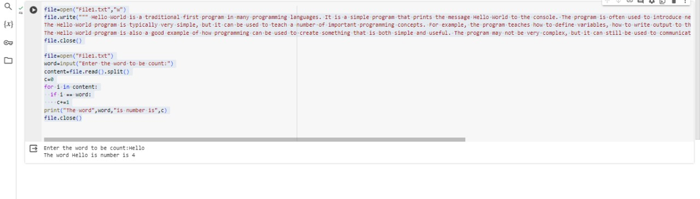

# Word-count
## AIM:
To write a python program for getting the word count from a text.
## EQUIPEMENT'S REQUIRED: 
PC
Anaconda - Python 3.7
## Step 1:
Declare the number of words is zero

## Step 2:
Open it with text file

## Step 3:
Initial the for loop with range of the content of words and 

## Step 4:
Then next split the words

## Step 5:
count the number of words

## Step 6:
Giving print statement for getting output

## PROGRAM:
```py 
file=open("File1.txt","w")
file.write(""" Hello World is a traditional first program in many programming languages. It is a simple program that prints the message Hello World to the console. The program is often used to introduce new programmers to a programming language and to test if a compiler or interpreter is working properly.
The Hello World program is typically very simple, but it can be used to teach a number of important programming concepts. For example, the program teaches how to define variables, how to write output to the console, and how to use basic programming constructs such as loops and conditional statements.
The Hello World program is also a good example of how programming can be used to create something that is both simple and useful. The program may not be very complex, but it can still be used to communicate a message to the world.""")
file.close()

file=open("File1.txt")
word=input("Enter the word to be count:")
content=file.read().split()
c=0
for i in content:
  if i == word:
    c+=1
print("The word",word,"is number is",c)
file.close()
```

### OUTPUT:


## RESULT:
Thus the program is written to find the word count from a text.
